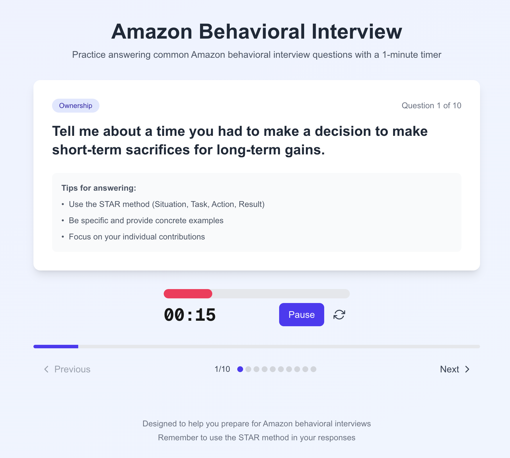

# Amazon Behavioral Interview Practice App

<div align="center">
  
  <p>Practice answering Amazon behavioral interview questions with a one-minute timer.</p>
</div>

[](LICENSE)
[](https://nextjs.org/)
[](https://www.typescriptlang.org/)
[](https://tailwindcss.com/)

A sleek, modern application designed to help you practice Amazon behavioral interview questions with a one-minute timer. Questions are organized into sessions with randomly selected questions from Amazon's leadership principles.

## ✨ Features

- Sessions with randomly selected questions (customizable from 5-20 questions per session)
- Comprehensive collection of questions covering all 16 Amazon Leadership Principles
- 60-second timer for practicing concise answers (auto-starts when navigating)
- Progress tracking within each session
- Session summary with statistics on completion
- Elegant navigation between questions
- Visual feedback when time is up
- Responsive design that works on desktop and mobile
- Light and dark mode support

## 🚀 Live Demo

Check out the live demo [here](https://amazon-interview-practice.vercel.app).

## 🛠️ Getting Started

Follow these instructions to run the project locally.

### Prerequisites

- Node.js (version 16.x or higher)
- npm or yarn

### Installation

1. Clone the repository
```bash
git clone https://github.com/yourusername/amazon-interview-practice.git
cd amazon-interview-practice
```

2. Install dependencies
```bash
npm install
# or
yarn install
```

3. Start the development server
```bash
npm run dev
# or
yarn dev
```

4. Open your browser and navigate to [http://localhost:3000](http://localhost:3000)

## 📱 Using the App

1. Start by customizing your session (default is 10 questions)
2. You'll be presented with a behavioral question and a one-minute timer
3. The timer starts automatically for each question
4. Try to finish your answer before the timer runs out
5. When the timer completes, you'll see a completion message
6. Use the navigation controls to move between questions in your session
7. The timer resets and auto-starts when navigating to a different question
8. At the end of a session, you'll see a summary of your practice and can start a new session

## 📋 Amazon Leadership Principles Covered

- Customer Obsession
- Ownership
- Invent & Simplify
- Are Right, A Lot
- Learn and Be Curious
- Hire and Develop the Best
- Insist on the Highest Standards
- Think Big
- Bias for Action
- Frugality
- Earn Trust
- Dive Deep
- Have Backbone; Disagree & Commit
- Deliver Results
- Strive to be Earth's Best Employer
- Success and Scale Bring Broad Responsibility

## 💡 Best Practices for Answering Behavioral Questions

- Use the STAR method (Situation, Task, Action, Result)
- Be specific and provide concrete examples
- Focus on your individual contributions
- Quantify your impact whenever possible
- Keep your answers concise but thorough

## 🏗️ Project Structure

```
/
├── public/              # Static assets
├── src/
│   ├── app/             # Next.js App Router
│   ├── components/      # Reusable UI components
│   ├── data/            # Interview questions data
│   └── utils/           # Utility functions
├── package.json         # Project dependencies and scripts
└── tailwind.config.js   # Tailwind CSS configuration
```

## 🧰 Built With

- [Next.js](https://nextjs.org/) - React framework
- [TypeScript](https://www.typescriptlang.org/) - Type safety
- [Tailwind CSS](https://tailwindcss.com/) - Styling
- [Framer Motion](https://www.framer.com/motion/) - Animations
- [React Confetti](https://github.com/alampros/react-confetti) - Celebration effects

## 🔮 Future Enhancements

- Reading countdown period before timer starts
- STAR method template alongside each question
- Audio recording feature for self-review
- Self-rating system after each question
- User accounts to track progress across multiple sessions
- Filtering questions by specific leadership principles
- AI-powered feedback on answers

## 📄 License

This project is licensed under the MIT License - see the [LICENSE](LICENSE) file for details.

## 🙏 Acknowledgements

- [Amazon Leadership Principles](https://www.amazon.jobs/en/principles)
- [Interview Prep Resources](https://www.amazon.jobs/en/landing_pages/interviewing-at-amazon)

## 👥 Contributing

Contributions are welcome! Please feel free to submit a Pull Request.

1. Fork the repository
2. Create your feature branch (`git checkout -b feature/amazing-feature`)
3. Commit your changes (`git commit -m 'Add some amazing feature'`)
4. Push to the branch (`git push origin feature/amazing-feature`)
5. Open a Pull Request
